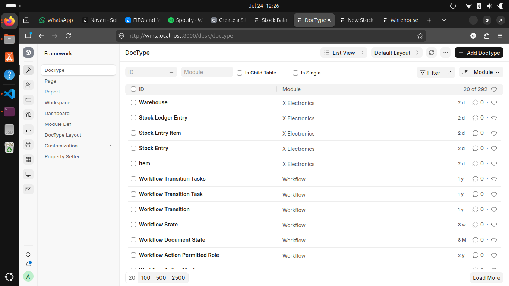
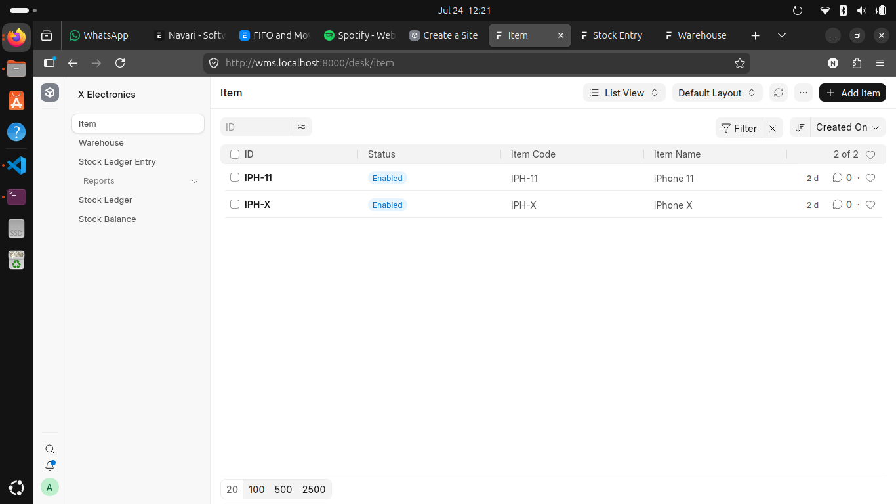
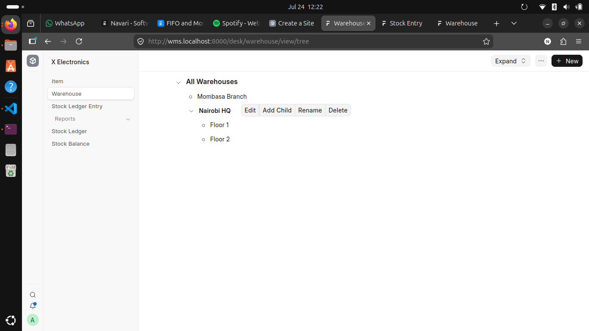

# X Electronics Warehouse Management System

A warehouse management app built on the [Frappe Framework](https://frappeframework.com/) for the Navari Software Engineer application exercise.

It implements a **stateless stock ledger** with **selectable valuation methods**: Moving Average (default), FIFO, and LIFO, chosen per Stock Entry. Stock movements are recorded as immutable ledger entries (deltas only), each recording the valuation method it was posted under, and balances and valuation are always computed at read time, never stored.

**Author:** William Ndoni · ndoniwilliam09@gmail.com

---

## Contents

1. [What it does](#what-it-does)
2. [Design decisions](#design-decisions)
3. [Valuation methods](#valuation-methods)
4. [Switching valuation methods mid-history](#switching-valuation-methods-mid-history)
5. [Screens](#screens)
6. [Reports](#reports)
7. [Tests](#tests)
8. [Setup](#setup)
9. [Structure](#structure)
10. [Known limitations and possible extensions](#known-limitations-and-possible-extensions)

## What it does

- **Item**: product master data (code, name, unit of measure, disabled flag). Item code is the primary key.
- **Warehouse**: a tree DocType (nested set). Group warehouses organize the hierarchy; only leaf warehouses hold stock.
- **Stock Entry**: a submittable document with three types and a **document-level valuation method** (Moving Average / FIFO / LIFO, defaulting to Moving Average):
  - **Receipt**: stock in, at a user-supplied rate
  - **Consume**: stock out, valued under the entry's chosen method
  - **Transfer**: stock between warehouses; the value leaving the source under the chosen method becomes the incoming leg's rate, so value is conserved
- **Stock Ledger Entry (SLE)**: the append-only event log. Written only by code (on Stock Entry submit), deleted only on cancel. Each row records the method it was valued under.
- **Stock Ledger report**: every movement with running balance, valuation rate, stock value, and the method applied per line
- **Stock Balance report**: balance per item/warehouse as on a date, with consolidation over the warehouse tree

## Design decisions

### Stateless ledger

Each SLE stores only the *delta* (`actual_qty`). There are no running balance or valuation columns, unlike ERPNext's SLE. Balances are derived by replaying the ledger at read time.

What this buys:

- **Backdated entries just work.** Every query filters and sorts by `posting_datetime`, so a backdated row lands in the right place logically with no recomputation of later rows (no "repost" machinery).
- **Cancellation is trivial.** Cancelling a Stock Entry deletes exactly its own ledger rows (targeted by `voucher_type` + `voucher_no`); nothing else needs updating.
- **No stale cache, ever.** There is no cached state to drift out of sync.

The trade-off is that reads replay history instead of reading a stored value. At this scale that is effectively instant; at ERPNext scale it is why they cache (and why they need reposting).

### The layer engine

With three valuation methods, a pooled (qty, value) state is not enough, because FIFO and LIFO need **cost layers**. The engine (`x_electronics/utils.py`) models stock in a warehouse as a queue of layers `(qty, rate)`:

- A **receipt** pushes a new layer at its incoming rate.
- **FIFO** consumption pops layers from the front (oldest cost first).
- **LIFO** consumption pops from the back (newest cost first).
- **Moving Average** consumption removes value at the pooled average, implemented as a proportional scale-down of every layer. This is numerically identical to the classic pooled average, while keeping layer structure intact so FIFO/LIFO entries can follow in the same history.

`consume_from_layers()` is the single home of all three rules; the Stock Entry controller and both reports use the same engine (`apply_row` / `layer_totals` / `get_layers`), so posting and reporting can never disagree.

**Layer order is defined by `posting_datetime`** (with the SLE `name` as a deterministic tiebreaker for same-moment entries). This is the business time of the movement, which the user can set, as opposed to the framework's `creation` timestamp, which records when the row was entered. "Oldest" for FIFO and "newest" for LIFO always mean oldest/newest by posting datetime, which is also why backdated receipts slot into their correct position as older layers.

### Method recorded per ledger row

Because valuation is computed at read time but the method is chosen at posting time, each outflow SLE **records the method it was consumed under** (`valuation_method`). Read-time replays apply each row's own recorded method. Consequences:

- History is reproducible forever. A report today and a report next year print the same numbers for the same period.
- Methods can coexist in one history (and there is a test proving a FIFO row and a LIFO row against the same layers both value correctly).
- Changing the default or choosing a different method on future entries never restates the past (see the switching section below).
- Ledger rows with no recorded method (including all history from before this feature existed) are read as Moving Average, which matches how they were actually posted.


### Natural keys

Items and Warehouses are named by their code/name (`field:` autonaming), so the ledger's foreign keys read as `IPH-X` and `Floor 1` rather than opaque IDs. The ledger table and reports are human-readable without joins. The cost is that renames cascade through link fields; Frappe handles the cascade, and it is an accepted trade for readability.

### Validation

All rules live in `stock_entry.py` as small single-purpose methods called from `validate()`:

- at least one item row
- warehouse requirements per entry type (and source ≠ target on transfers)
- no group warehouses; stock lives only in leaves
- qty > 0 (the sign is derived from the entry type by the system, never typed); rate required on receipts only, cleared elsewhere
- disabled items/warehouses rejected
- **sufficient stock**: consumption/transfers are checked against the computed balance *as of the entry's posting datetime* (excluding the entry's own prior rows), so backdated entries validate against the world as it stood at that moment

## Valuation methods

The method decides how the total cost of stock splits between **what leaves** (cost of goods consumed) and **what remains** (inventory value). Worked example: receive 100 @ 500, then 100 @ 600, then consume 100:

| Method | Cost assigned to the 100 consumed | Value of the 100 remaining |
|---|---|---|
| FIFO | 100 × 500 = **50,000** | 60,000 (the newer layer) |
| LIFO | 100 × 600 = **60,000** | 50,000 (the older layer) |
| Moving Average | 100 × 550 = **55,000** | 55,000 |

Total is always 110,000. Methods never create or destroy value; they only allocate it. Because "cost of what left" flows into profit calculations, the method choice directly shapes reported profit: with rising prices, FIFO reports higher profit (it expenses old cheap stock), LIFO lower (it expenses new expensive stock), Moving Average in between.

**Where the choice is made:** on the Stock Entry document (the lowest level). If the user selects nothing, the field defaults to **Moving Average**. The chosen method drives that entry's outflow valuation and, for transfers, the value carried to the destination, and it is stamped on every ledger row the entry creates.

**The method only affects outflows.** A receipt pushes a cost layer identically under every method, so choosing a method on a Receipt has no effect (it is stamped on the row as inert metadata). There is no such thing as "FIFO stock" or "LIFO stock" sitting on the shelf. Methods decide which costs *leave*, applied at the moment of consumption or transfer against whatever layers exist then. One consequence worth noting: consuming the entire balance yields the same value under all three methods, since every allocation rule allocates everything.

**Transfers under FIFO/LIFO:** the value leaving depends on *which layers* the transferred quantity consumes (e.g. 60 units under FIFO taking 50 @ 500 + 10 @ 600 leave at 31,000 → incoming rate 516.67). The incoming leg arrives as one blended layer at that rate. A fully layer-preserving alternative (one incoming SLE per consumed source layer) is possible with the same schema; I chose the blended single leg for simplicity and documented the trade-off.

## Switching valuation methods mid-history

*What happens if a user runs FIFO for two weeks, then switches to LIFO or Moving Average?*

**In this design, the switch is prospective-only, and history is safe.** Because each ledger row permanently records the method it was posted under, past consumptions keep their as-posted valuation forever. Reports replay history exactly as it happened; nothing restates. Contrast this with a design where the method is a global setting applied at read time: flipping it there would silently revalue all history. Figures for closed periods would change, previously exported reports would no longer match the system, and the same report would print different answers on different days. Recording the method per row is what prevents that.

**Even prospectively, three real issues remain:**

1. **Path dependence.** Two weeks of FIFO consumed the *oldest* layers, leaving the newest, most expensive stock on hand. Switching to LIFO now pops exactly those expensive layers, so post-switch consumption costs jump more than an always-LIFO history would have shown, and the surviving layer mix is a residue no single method would naturally produce. Comparing costs across the switch date compares two different measurement rules applied to a distorted starting position.
2. **Comparability and perception.** Month-to-month cost and profit figures stop being comparable across the switch. Timed around a price movement, a method switch can legitimately be suspected of profit manipulation. This is why, in accounting practice, a valuation method is a *policy* applied consistently, and changes require justification and disclosure (IAS 8), not a per-document dropdown.
3. **Compliance.** Under IFRS (IAS 2), the standards applied in Kenya, **LIFO is not a permitted inventory valuation method**; only FIFO and weighted average are allowed. The LIFO option here is implemented for the exercise's completeness and to demonstrate the layer engine; a production deployment for an IFRS reporter should disable it.

## Screens

### DocTypes


### Item


### Warehouse tree

*Group warehouses organize the hierarchy; only leaf warehouses hold stock.*

### Stock Ledger Entry

*The stateless ledger: deltas only, each row recording its voucher and valuation method.*

### Stock Entry (parent)

*Entry type and document-level valuation method, with the items grid.*

### Stock Entry Item (child)

.png>)

### Insufficient stock rejected

*Over-consumption is blocked with the computed available balance, the stateless design's balance check in action.*

## Reports

**Stock Ledger** is the full movement log with filters (item, warehouse, date range). Each line shows the movement plus the running balance, valuation rate, and stock value *after* it, and the valuation method applied. Item/warehouse filters are applied in SQL; date filters are applied **after** the replay, because starting the computation mid-history would lose the opening balance. Item/warehouse partitions are independent, time is not.


*Mixed Moving Average and FIFO rows valued correctly in one history.*

**Stock Balance** shows one row per item/warehouse with balance qty, valuation rate (the blended carrying average of the remaining layers), and stock value **as on a date** (inclusive end-of-day: `posting_datetime < date + 1 day`). Filtering by a **group** warehouse consolidates every descendant with a single nested-set range condition:

```sql
warehouse IN (SELECT name FROM `tabWarehouse`
              WHERE lft >= %(lft)s AND rgt <= %(rgt)s AND is_group = 0)
```

No recursion needed: the `lft`/`rgt` numbers *are* the hierarchy. A leaf's range contains only itself, so one code path serves both cases.


*Filtered by a group warehouse (Nairobi HQ): all descendant warehouses consolidated.*

## Tests

21 integration tests cover all non-report functionality and both report behaviors:

- **Stock Entry (17):**
  - SLE creation for all three entry types; cancellation cleanup
  - every validation rule (warehouse requirements, group-warehouse rejection, qty/rate rules, disabled masters, insufficient stock)
  - Moving Average properties: average stable through consumption (the 714.29 regression test), value conserved across transfers, average updated correctly by new receipts (the 508.33 case)
  - FIFO consumes oldest layers first; LIFO newest first (mirror scenarios: 48,000 vs 40,000 remaining from identical events)
  - Moving Average sits between them on the same events (44,000)
  - FIFO transfers carry layer-derived value with total value conserved
  - mixed FIFO + LIFO rows in one history value correctly
- **Stock Balance report (4):** per-warehouse balances, group-warehouse consolidation (children included, outsiders excluded), leaf filtering, and as-on-date behavior

Tests are hermetic: each test creates uniquely named fixtures (hash-suffixed), so no test depends on database state or on other tests. That was a lesson learned the hard way, when shared fixtures leaked state between tests and produced a wrong-but-plausible valuation number.

Run them:

```bash
bench --site <your-site> set-config allow_tests true
bench --site <your-site> run-tests --app x_electronics
```

## Setup

```bash
cd frappe-bench
bench get-app https://github.com/<your-username>/x_electronics
bench --site <your-site> install-app x_electronics
bench --site <your-site> migrate
```

Built and tested on Frappe `develop` (v17.x), commit `<frappe-commit-hash>`. The app uses only stable core APIs (DocTypes, controller hooks, script reports), so it is expected to work on v15/v16 as well.

## Structure

```
x_electronics/
├── utils.py                     # layer engine: consume_from_layers, apply_row,
│                                #   layer_totals, get_layers, get_stock_state,
│                                #   get_valuation_rate, get_outgoing_rate
└── x_electronics/
    ├── doctype/
    │   ├── item/
    │   ├── warehouse/           # tree DocType (nested set)
    │   ├── stock_ledger_entry/  # the stateless ledger (records method per row)
    │   ├── stock_entry_item/    # child table
    │   └── stock_entry/         # validation + ledger posting (+ 17 tests)
    └── report/
        ├── stock_ledger/        # movement view, per-row method
        └── stock_balance/       # position view, consolidation (+ 4 tests)
```

## Known limitations and possible extensions

- **Backdating vs validation:** the sufficient-stock check validates against the balance as of the entry's posting time with the information available then; a backdated entry inserted later can still drive a historical balance negative. This is inherent to allowing backdating in any ledger system; the reports always tell the truth regardless.
- **Transfers as blended layers:** under FIFO/LIFO the incoming leg is one blended layer; a layer-preserving variant (one SLE per consumed layer) is a straightforward extension.
- **Method governance:** per-document choice was the requirement; a production system should constrain it to policy level (see the switching section).
- **Natural next features:** reorder levels with low-stock highlighting in Stock Balance; per-item default valuation method; additional voucher types (Purchase Receipt, Delivery Note) posting to the same ledger. The voucher design already anticipates this.